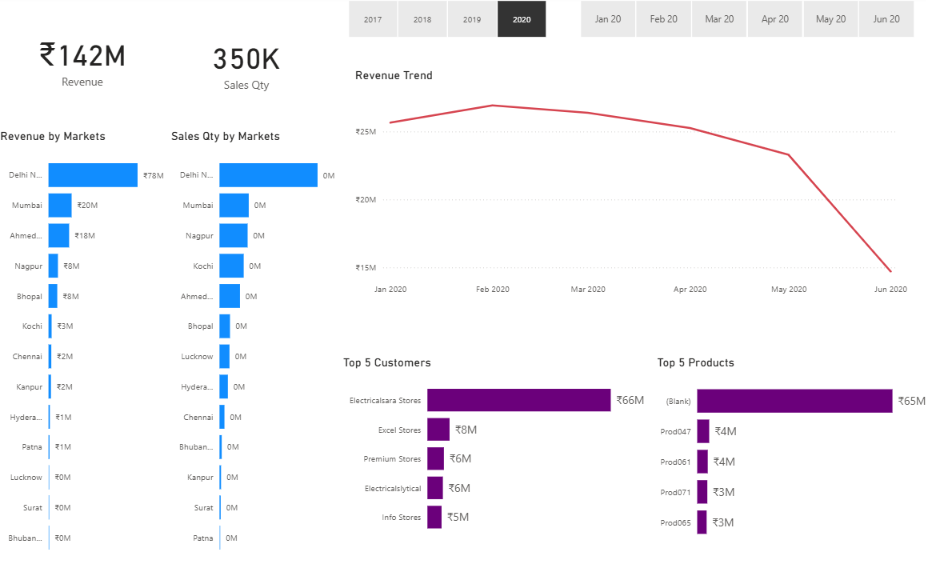
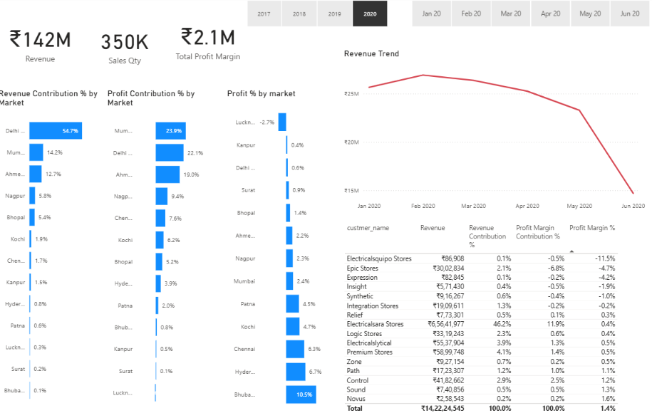
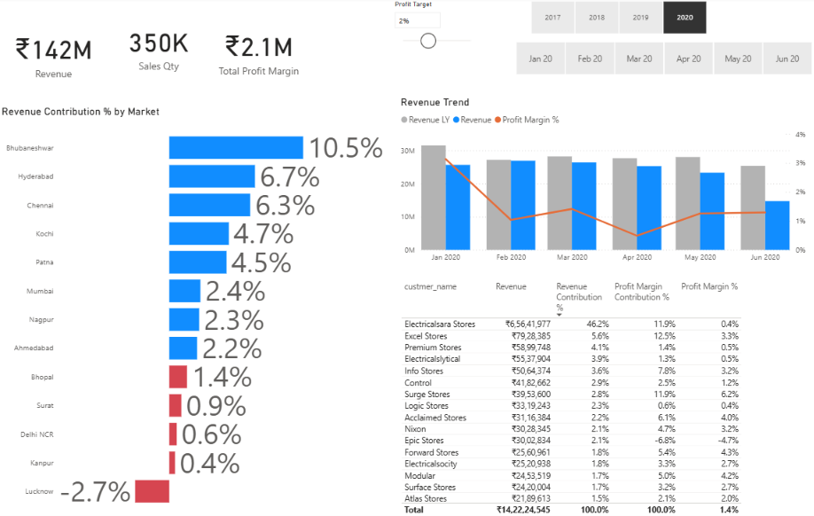

# 📊 Sales Insights Dashboard | Power BI

An interactive **Sales Insights Dashboard** built using **Power BI and MySQL** to analyze sales performance across markets, customers, products, and time periods.

---

## 📊 Project Overview

The **Sales Insights Dashboard** is an interactive business intelligence project built using **Power BI** and **MySQL**.

The dashboard analyzes sales performance across different markets, customers, products, and time periods. It provides key business metrics and interactive filters to help users understand sales trends, profitability, and high-performing areas.

---

## 🎯 Business Objectives

- Analyze overall revenue and sales quantity.
- Compare revenue performance across different markets.
- Analyze sales performance by customers.
- Identify the top-performing products.
- Track sales trends over time.
- Analyze profit contribution and profitability.
- Provide interactive filtering by year and month.

---

## 🛠️ Tools & Technologies

- **Power BI** – Data visualization and dashboard development
- **MySQL** – Database management and data extraction
- **SQL** – Data querying and analysis
- **DAX** – Measures and calculations
- **Power Query** – Data transformation and preparation
- **GitHub** – Project version control and documentation

---

## 📈 Dashboard Features

### Key Performance Indicators

- Total Revenue
- Total Sales Quantity
- Total Profit Margin

### Sales Analysis

- Revenue by Market
- Sales Quantity by Market
- Revenue Trend
- Top 5 Customers
- Top 5 Products

### Profit Analysis

- Revenue Contribution by Market
- Profit Contribution by Market
- Profit % by Market
- Customer-level profitability analysis

### Interactive Filters

- Year-wise filtering
- Month/date-wise filtering

The dashboard allows users to select a year and analyze the corresponding monthly sales and profitability performance interactively.

---

## 🔄 Project Workflow

```text
Data Extraction
       ↓
MySQL Database
       ↓
Data Transformation
       ↓
Power Query
       ↓
Data Modeling
       ↓
DAX Measures & Calculations
       ↓
Power BI Dashboard
       ↓
Sales & Profit Analysis
       ↓
Business Insights
```

---

## 📸 Dashboard Preview

### 1. Key Insights

The Key Insights dashboard provides an overview of revenue, sales quantity, revenue trends, market performance, top customers, and top products with interactive year and month filters.



---

### 2. Profit Analysis

The Profit Analysis dashboard analyzes revenue contribution, profit contribution, profit percentage by market, revenue trends, and customer-level profitability metrics.



---

### 3. Performance Insights

The Performance Insights dashboard compares market-level revenue contribution and performance trends while providing detailed customer-level performance analysis.



---

## 🗄️ Database

The project uses a **MySQL sales database** containing sales-related information such as:

- Customers
- Products
- Markets
- Dates
- Sales Transactions

The SQL database dump is provided in:

```text
sales_insights_db.sql
```

---

## 📁 Project Files

```text
Sales-Insights-PowerBI/
│
├── README.md
├── Sales_Insights.pbix
├── sales_insights_db.sql
├── key_insights.png
├── profit_analysis.png
└── performance_insights.png
```

---

## 🚀 How to Use

1. Download the `Sales_Insights.pbix` file.
2. Install **Power BI Desktop**.
3. Set up the MySQL database using `sales_insights_db.sql`.
4. Open the `.pbix` file in Power BI Desktop.
5. Update the database connection if required.
6. Refresh the data to explore the dashboard.

---

## 💡 Key Insights

The dashboard helps identify:

- High-performing markets
- Top customers by revenue
- Top products by revenue
- Revenue trends over time
- Market-level profit contribution
- Customer-level profitability
- Changes in sales performance across different periods

---

## 👤 Author

**Anshu Pritam Pal**

GitHub: [AnshuPritamPal](https://github.com/AnshuPritamPal)
